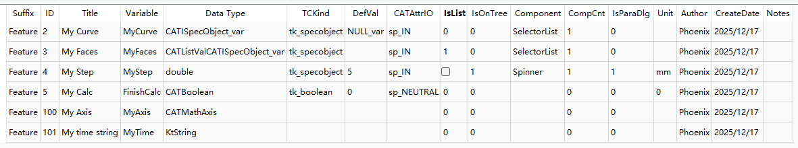

# 1 📋 参数配置规范文档

---

## 1.1 📁 文件类型

**版本说明：**
- **旧版本**：CSV 格式文件
- **新版本**：JSON 格式文件（编码为 UTF-8）
- **功能**：新版本提供 CSV 到 JSON 的导入转换功能

---

## 1.2 📊 参数数据表示例

| 参数后缀    | 编号  | 显示名称           | 变量名        | 数据类型                         | 特征类型          | 默认值      | 输入输出       | 列表  | 特征树显示 | 界面控件         | 控件数量 | 参数对话框 | 单位  | 作者      | 创建日期       | 备注  |
| :------ | :-- | :------------- | :--------- | :--------------------------- | :------------ | :------- | :--------- | :-- | :---- | :----------- | :--- | :---- | :-- | :------ | :--------- | :-- |
| Feature | 2   | My Curve       | MyCurve    | CATISpecObject_var           | tk_specobject | NULL_var | sp_IN      | 0   | 0     | SelectorList | 1    | 0     |     | Phoenix | 2025/12/17 |     |
| Feature | 3   | My Faces       | MyFaces    | CATListValCATISpecObject_var | tk_specobject |          | sp_IN      | 1   | 0     | SelectorList | 1    | 0     |     | Phoenix | 2025/12/17 |     |
| Feature | 4   | My Step        | MyStep     | double                       | tk_specobject | 5        | sp_IN      | 0   | 1     | Spinner      | 1    | 1     |     | Phoenix | 2025/12/17 |     |
| Feature | 5   | My Calc        | FinishCalc | CATBoolean                   | tk_boolean    | 0        | sp_NEUTRAL | 0   | 0     |              | 0    | 0     | 0   | Phoenix | 2025/12/17 |     |
| Feature | 100 | My Axis        | MyAxis     | CATMathAxis                  |               |          |            | 0   | 0     |              | 0    | 0     |     | Phoenix | 2025/12/17 |     |
| Feature | 101 | My time string | MyTime     | KtString                     |               |          |            | 0   | 0     |              | 0    | 0     |     | Phoenix | 2025/12/17 |     |

**参数表格界面示例**

---

## 1.3 📝 列详细说明

### 1.3.1 核心标识列

| 列名 | 说明 | 详细规则 |
| :--- | :--- | :--- |
| **NameSuffix** | 参数类型后缀 | 标识参数所属的类型或类名的尾端（如 "Feature"） |
| **ID** | 参数唯一标识符 | 区分不同参数的编号，具有特定范围规则 |
| **Name** | 参数显示名称 | 仅用于界面显示的注释名称，无代码作用 |
| **ParamString** | 参数变量名 | 在代码中引用的标识符，需遵循命名规则 |

### 1.3.2 数据类型列

| 列名               | 说明         | 详细规则                                 |
| :--------------- | :--------- | :----------------------------------- |
| **DataType**     | 参数的数据类型    | 支持 Qt、CAA 或 C++ 类型，包括自定义类型           |
| **DefaultValue** | 参数的默认值     | 参数初始化时的默认值 指针类型填写 `NULL`          |

### 1.3.3 特征属性列
- **注意：非 CAA 特征留空**

| 列名               | 说明             | 详细规则                                      |
| :--------------- | :------------- | :---------------------------------------- |
| **TCKind**       | CAA 特征类型标识     | 必须从 CAA 相关枚举中选择                        |
| **CATAttrInOut** | CATIA 属性输入输出方向 | 定义参数是输入(sp_IN)、输出(sp_OUT)还是中性(sp_NEUTRAL) |
| **IsList**       | 是否为列表/数组类型     | 0：单个值 1：列表/数组                          |
| **IsOnTree**     | 是否在特征树上显示      | 0：不显示 1：显示                             |

### 1.3.4 界面控件列

| 列名                 | 说明          | 详细规则                                                         |
| :----------------- | :---------- | :----------------------------------------------------------- |
| **Component**      | 界面控件类型      | 支持 Qt 和 CAA 类型的控件组件                                          |
| **ComponentCount** | 控件组件数量      | 0：不生成界面代码 1：大部分控件使用 大于1：适用于 CheckButton 和 RadioButton等 |
| **IsParamDlg**     | 是否在参数对话框中显示 | 0：不显示 1：显示（需在参数对话框中进行配置）                                  |
| **Unit**           | 参数的单位       | 支持识别 `mm` 和 `deg` 程序会自动转换为 `m` 和弧度                        |

### 1.3.5 元数据列

| 列名 | 说明 | 详细规则 |
| :--- | :--- | :--- |
| **Author** | 参数创建者 | 记录创建人员信息 |
| **CreateDate** | 创建日期 | 记录参数创建日期 |
| **Notes** | 备注信息 | 记录额外的说明信息 |

---

### 1.3.6 🔢 ID 字段规范

#### 1.3.6.1 编号范围规则

| 范围 | 类别 | 说明 |
| :--- | :--- | :--- |
| **1-99** | 主动变量范围A | 主动变量，或 CAA 特征的输入输出参数 |
| **100-199** | 过程变量范围 | 非特征输入输出的一般变量 |
| **200-299** | 主动变量范围B | 主动变量 |

#### 1.3.6.2 构造函数中的表现

| ID起始 | 前缀 | 说明 |
| :--- | :--- | :--- |
| 从 **1** 开始 | `:` | 以冒号开头 |
| 其他情况 | `,` | 以逗号开头 |

---
### 1.3.7 IsOnTree字段规范

- 只有CAA语言，需要这个，
- 如果为1，TCKind必须为tk_specobject
- 变量类型不能为CATISpecObject_var, 不能为特征
- 变量类型为具体的double，int，string等树上轻特征支持的类型。

---

### 1.3.8 🏷️ 控件命名规范

### 1.3.9 命名规则

| 控件数量 | 命名规则 | 示例 |
| :--- | :--- | :--- |
| **数量为 1** | `控件类型名 + 变量名` | `SelectorListMyCurve` |
| **数量大于 1** | `控件类型名 + 变量名 + 序号` | `CheckButtonDisplayType0` `CheckButtonDisplayType1` |

### 1.3.10 序号规则

- 序号从 **0** 开始计数
- 按顺序递增

### 1.3.11 命名示例

| 变量名 | 控件类型 | 数量 | 生成的界面控件名 |
| :--- | :--- | :--- | :--- |
| MyCurve | SelectorList | 1 | `SelectorListMyCurve` |
| MyStep | Spinner | 1 | `SpinnerMyStep` |
| DisplayType | CheckButton | 2 | `CheckButtonDisplayType0` `CheckButtonDisplayType1` |
| SolidType | RadioButton | 3 | `RadioButtonSolidType0` `RadioButtonSolidType1` `RadioButtonSolidType2` |
| DisplayType | QCheckBox | 2 | `QCheckBoxDisplayType0` `QCheckBoxDisplayType1` |

---

## 1.4 ✏️ 变量命名规范

### 1.4.1 带界面元素的变量

适用于 **CAA 特征变量**和**Qt 界面变量**：

- ✅ 必须包含 **至少 2 个单词**
- ✅ 使用 **大写驼峰命名法**（PascalCase）
- ⚠️ 避免与现有变量名重复，防止混淆

**良好示例：**
- `MyCurve`
- `InputSurface` 
- `DraftDirection`

### 1.4.2 非界面变量

- 可以使用小写或其他命名规则
- 无特殊要求

---

## 1.5 🔧 CAA 语言相关规范

### 1.5.1 Field 控件规范

**适用控件类型：**
- `SelectorList`
- `MultiList`

**功能说明：**[]()
- 自动生成 field 枚举代码
- 根据变量名自动初始化筛选器

### 1.5.2 变量名自动筛选器规则

变量名包含特定关键词时，会自动初始化相应的类型筛选器：

| 变量名包含的关键词 | 默认筛选器类型 | 变量名示例 | 备注 |
| :--- | :--- | :--- | :--- |
| **Axis** | 坐标系 | `CurrentAxis` | |
| **Line、Segment、Direction** | 直线/拓扑直线 | `DraftDirection` | |
| **Face、Surface** | 面特征/拓扑面 | `InputSurface` | |
| **Point** | 点/拓扑点 | `RefPoint` | |

**注意事项：**
- 自动筛选器不满足需求时，需手动设置新筛选类型
- 筛选器指针类型不匹配时，需释放并重新初始化

### 1.5.3 列表类型参数示例

| 显示名称 | 变量名 | 数据类型 | 特征类型 | 列表 | 界面控件 | 数量 | 生成的界面控件名 |
| :--- | :--- | :--- | :--- | :--- | :--- | :--- | :--- |
| 第一方向 | DirectionX | CATMathVector | tk_double | 1 | Spinner | 1 | `SpinnerDirectionX0` `SpinnerDirectionX1` `SpinnerDirectionX2` |
| 原点 | OriginPoint | CATMathPoint | tk_double | 1 | Spinner | 1 | `SpinnerOriginPoint0` `SpinnerOriginPoint1` `SpinnerOriginPoint2` |
| 输入面 | InputSurfaces | CATListValCATISpecObject_var | tk_specobject | 1 | SelectorList | 1 | `SelectorListInputSurfaces` |
| 角度数组 | OutAngles | CATRawColldouble | tk_double | 1 | | 0 | |
| 数量数组 | OutCounts | CATRawCollint | tk_integer | 1 | | 0 | |
| 字符串数组 | OutStrings | CATListValCATUnicodeString | tk_string | 1 | | 0 | |

---

**文档总结：** 本文档详细说明了参数配置的完整规范，包括文件格式、参数表格结构、各列定义规则、ID编号规范、控件命名规则、变量命名规范以及CAA相关特殊规则。遵循这些规范可以确保参数配置的一致性和代码生成的正確性。